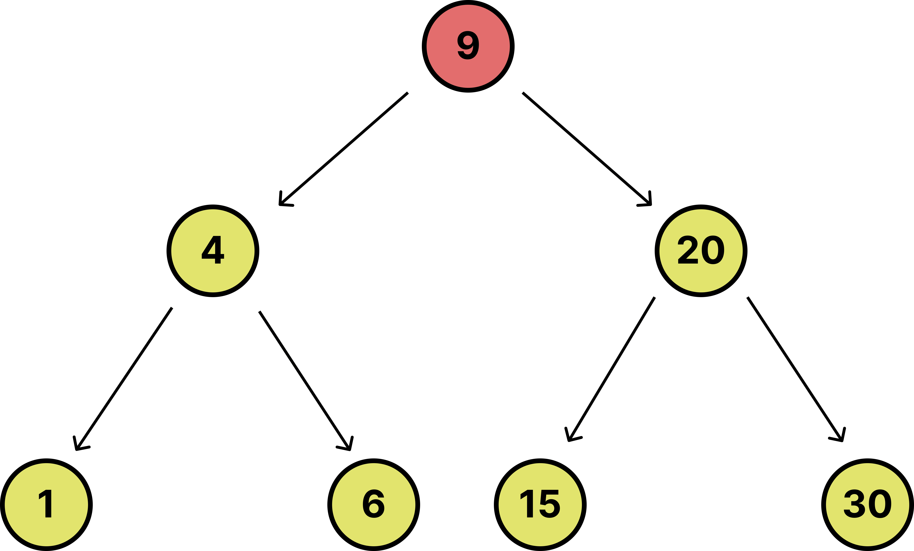
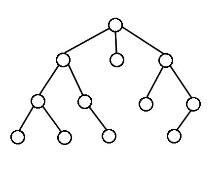

# 트리(Tree)

트리(Tree)는 계층적(hierarchical) 데이터 구조로 여러 개의 노드(node)가 부모-자식 관계로 연결되어 있는 자료구조.
마치 나무가 땅에 뿌리를 내리고 가지를 뻗어나가는 것처럼, 트리도 하나의 루트(root) 노드에서 시작해 여러 개의 자식 노드를 가지며 뻗어나간다.

```text
      A (루트)
     / \
    B   C
   / \   \
  D   E   F
```

- **루트(Root) 노드**
  - 트리의 가장 꼭대기 노드(A)입니다. 트리는 이 루트에서 시작해 아래로 뻗어 나간다.
- **부모(Parent)와 자식(Child)**
  - A 노드의 자식은 B, C 노드고요. 반대로 B, C 노드의 부모는 A 노드
  - B 노드의 자식은 D, E 노드고요. 반대로 D, E 노드의 부모는 B 노드
  - 마지막으로, C 노드의 자식은 F 노드이며 F 노드의 부모는 C 노드!
- **리프(Leaf) 노드**
  - D, E, F 노드와 같이 자식이 없고 가장 깊은 곳에 있는 노드를 리프 노드라고 한다!
- **형제(Sibling)**
  - 같은 부모를 가진 노드들을 **형제**라고 부릅니다.
  - 여기선, B, C 노드가 서로 형제 노드겠죠. 그리고 D, E 노드도 마찬가지일테고요.

트리는 계층적 구조를 워낙에 잘 나타내기 때문에 디렉토리 구조, 회사 조직도, 파일 시스템 등 많은 실제 사례에서 사용되고 있어요! 이외에 트리를 배울 때 알아두어야 할 몇 가지 중요한 용어들이 더 있어요

- **노드(Node)**
  - 트리에서 데이터를 저장하는 요소를 **노드**라고 해요. 트리의 각 점이 노드입니다.
  - 여기선 A ~ F가 전부 노드에요.
- **간선(Edge)**
  - 노드 간의 관계를 나타내는 선입니다. 부모-자식 관계를 연결하는 선이라고 보면 돼요.
  - 그래프에도 똑같이 있는데요. 그래프에선 간선의 끝에 있는게 노드가 아니고 버텍스라고 불러요.
  - `A-B`, `A-C`, `B-D`는 모두 간선입니다.
- **레벨(Level)**
  - 트리에서 **루트로부터의 깊이**를 나타내는 개념입니다.
  - 루트는 0레벨, 루트의 자식은 1레벨, 그 자식은 2레벨... 이런 식으로 트리의 깊이를 나타냅니다.
  - 여기서 A는 0, B, C는 1, 그리고 D, E, F는 2레벨이에요.

# 이진 트리(Binary Tree)

이진 트리(Binary Tree)는 각 노드가 최대 두 개의 자식만 가질 수 있는 트리입니다. 이진 트리는 많은 알고리즘에서 사용되고 있어요. 특히나, 이진 트리에서 파생 된 이진 탐색 트리(Binary Search Tree)는 매우 중요한 역할을 합니다!

## 이진 탐색 트리(Binary Search Tree)

이진 탐색 트리(이하, BST)는 이진 트리의 한 종류로, 탐색에 최적화된 구조를 가집니다. 제가 수업시간 때 항상 얘기했던 대표적인 숫자 맞추기 놀이가 이 BST랑 같다고 생각하시면 됩니다. BST는 이런 규칙을 갖고 있어요.

1. **왼쪽 서브트리**의 값 < **부모 노드**의 값
2. **오른쪽 서브트리**의 값 > **부모 노드**의 값
3. 이러한 규칙이 **모든 노드에서 재귀적으로** 적용

```text
      8
     / \
    3   10
   / \    \
  1   6    14
     / \   /
    4   7 13
```

1 ~ 13까지 빠진 수들도 있지만 대충봐도 중간 값인 것 같은 8이 꼭대기에 있어서 중심을 잡아주고 그 왼쪽엔 8보다 작은 친구들(1, 3, 4, 6, 7)이 있고 오른쪽엔 8보다 큰 친구들(10, 13, 14)가 있어요. 그래서, 이 트리에서 특정 값을 탐색할 땐 이분법 기반 탐색(이하, 이진 탐색)이 가능한겁니다.

그러면, BST의 탐색 방법을 한 번 살펴볼까요?

1. 루트 노드부터 시작하여, 찾고자 하는 값과 비교합니다.
2. 찾는 값이 현재 노드의 값보다 작으면 **왼쪽 서브트리**로 이동합니다!
3. 찾는 값이 현재 노드의 값보다 크면 **오른쪽 서브트리**로 이동합니다!
4. 이 과정을 반복하며, 값을 찾거나 노드가 없으면 탐색을 종료해요.

이진 탐색 트리는 평균적으로 탐색, 삽입, 삭제가 O(log N)의 시간 복잡도를 가집니다. 하지만, 트리가 한쪽으로 치우친 경우에는 최악의 경우 O(N)이 될 수 있습니다. 그러면, 어떻게 트리가 생성되는지 그리고 삭제를 할 땐 어떻게 삭제가 되는지 직접 실습을 한 번 해볼까요?

https://www.cs.usfca.edu/~galles/visualization/BST.html

# 이진 트리와 BST의 차이점

이진 트리 | BST
구조: 각 노드가 최대 두 개의 자식을 가질 수 있음 |
규칙: 왼쪽 자식은 부모보다 작고, 오른쪽 자식은 부모보다 큼
값의 배치에 대한 특정 규칙이 없음 |
값의 배치가 규칙적이며, 탐색에 최적화되어 있음 |
삽입, 탐색, 삭제 연산의 시간 복잡도는 제한적 |
균형잡힌 BST의 경우 탐색, 삽입, 삭제가 O(log N) 시간에 가능 |

# DFS(깊이 우선 탐색)

DFS(Depth First Search)는 깊이 우선 탐색이라는 의미로, 트리나 그래프를 최대한 깊이 들어가서 탐색하는 방법입니다. 즉, 아래의 그림처럼 한 경로를 끝까지 탐색한 후에 다른 경로로 이동합니다.



저번 강의에서 재귀에 대해서 배웠었죠? **DFS 기반의 탐색은** **재귀를 이용해서 구현**할 수 있습니다. 알고리즘에선 재귀가 참 쓰임새가 많죠? 트리에서 DFS를 수행할 때는 루트 노드에서 시작해서 한쪽으로 최대한 깊이 들어간 후에 자식 노드를 모두 방문한 후에 다시 부모로 돌아와 다른 자식을 방문하는 방식이에요. 참고로 위와 같은 순회 방식을 Pre-order traverse 즉, **전위 순회**라고 합니다.

- **장점**
  - 트리의 깊이를 먼저 탐색하므로, **깊이 우선 탐색이 유리한 문제**에 적합합니다!
      <aside>
      🤔
      
      **어라? 튜터님… 깊이 우선 탐색이 언제 유리한가요?** 
      
      </aside>
      
      - 미로가 있다고 가정을 해볼게요. 미로에서 출발지에서 시작해서 한 경로를 끝까지 쭉 탐색하다가 막히면 다시 돌아와 다른 경로를 탐색해야 하죠?
      - 이럴 때, DFS는 미로를 해결하는 데 유리합니다. 왜냐하면 **한 길을 끝까지 가보고** 막힌 경우에만 돌아와서 **다른 경로를 시도**하기 때문이죠! → 이 때, 전위 순회를 가장 많이 사용합니다. 처리 순서가 매우 직관적이어서요.
      - 알고리즘 문제를 풀다보면 **1) 모든 경우의 수(혹은 모든 경로)를 찾거나** 2**) 퍼즐을 푸는 문제**들이 나오는 경우가 있는데 이럴 때 **DFS로 모든 가능한 선택지를 일단 끝까지 가보는 전략**이 필요합니다!
      - 나중에, Backtracking에 대해서도 공부하실텐데 이 때도 DFS 개념을 접할 수 있어요!
- **단점**

  - 트리의 깊이가 매우 깊으면 **스택 오버플로우**가 발생할 수 있습니다.

  코딩 테스트를 준비함에 있어 재귀를 다루는 능력 및 DFS 기반으로 탐색할 수 있는 능력은 매우 필수적입니다! 그러니, 지금 이해를 못한다고 해도 나중에 꼭 복습해보시길 바랍니다! 이제, BFS에 대해서도 살펴볼까요?

  # BFS(너비 우선 탐색)란?

  BFS(Breadth First Search)는 너비 우선 탐색이라는 의미로 트리의 같은 레벨에 있는 노드들을 먼저 방문한 후에 다음 레벨로 이동해 탐색하는 방식입니다. 즉, 트리의 너비를 먼저 탐색하고, 그다음에 깊이를 탐색합니다.

  

  그렇다면, 이 BFS는 어떻게 구현을 할 수 있을까요? **BFS**는 **큐(Queue)를 사용하여 구현**할 수 있습니다.

<aside>
🤔

**튜터님. DFS는 깊게 가야되니까 재귀 기반으로 구현하면 되는 것은 알겠는데 BFS는 왜 큐로 구현해요?**

</aside>

BFS에서의 핵심은 노드를 탐색할 때는 먼저 방문한 노드의 자식들을 모두 큐에 넣고 그 자식들을 차례차례 탐색한다는 점이에요. 이 과정이 바로 같은 레벨에 있는 노드들을 먼저 탐색하는 방식과 일치하게 됩니다. 이를 큐로 구현하면 자연스럽게 노드가 레벨 순서대로 탐색됩니다.

```text
      A
     / \
    B   C
   / \   \
  D   E   F
```

BFS 탐색 순서는 A → B → C → D → E → F 순서입니다. 이 순서를 어떻게 큐를 사용해 구현할 수 있을까요

**BFS 탐색 과정**

1. 처음에는 루트 노드 A를 큐에 넣습니다.
   - 큐 상태: `[A]`
2. 큐에서 A를 꺼내고, A의 자식들 B와 C를 큐에 넣습니다.
   - 큐 상태: `[B, C]` → 탐색: `[A]`
3. 큐에서 B를 꺼내고, B의 자식들 D와 E를 큐에 넣습니다.
   - 큐 상태: `[C, D, E]` → 탐색: `[A, B]`
4. 큐에서 C를 꺼내고, C의 자식 F를 큐에 넣습니다.
   - 큐 상태: `[D, E, F]` → 탐색: `[A, B, C]`
5. 큐에서 D를 꺼내고, D는 자식이 없으므로 아무것도 하지 않습니다.
   - 큐 상태: `[E, F]` → 탐색: `[A, B, C, D]`
6. 큐에서 E를 꺼내고, E는 자식이 없으므로 아무것도 하지 않습니다.
   - 큐 상태: `[F]` → 탐색: `[A, B, C, D, E]`
7. 큐에서 F를 꺼내고, F는 자식이 없으므로 아무것도 하지 않습니다.
   - 큐 상태: `[]` → 탐색: `[A, B, C, D, E, F]` → **탐색 종료!**

즉, 이렇게 큐를 이용하면 너비 기반 탐색과 동일하게 탐색을 할 수 있어요! FIFO(선입선출)이기 떄문에 즉, **큐에서 먼저 들어온 노드들이 먼저 처리되기 때문에**, 같은 레벨에 있는 노드들(B와 C)가 먼저 탐색되고, 그다음 레벨인 D, E, F가 탐색됩니다. 이렇게 큐 덕분에 너비 우선으로 탐색을 할 수 있어요.

이제, 왜 BFS는 큐를 이용해서 구현해야 되는지 이해가 좀 되시죠? 그러면, BFS 기반 탐색의 장점과 단점도 한 번 살펴볼까요?

- **장점**
  - **최단 경로 탐색**에 유리합니다!
  - BFS는 **루트에서 가장 가까운 노드부터 탐색하는 방법**이기 때문에 루트에서부터 노드까지의 레벨이 낮을수록 경로가 짧아요!
  - 다시 말해, **루트에서 해당 노드까지 가는 길의 깊이가 짧을수록 그 경로가 더 짧은 경로**입니다.
  - 위의 트리 기준으로 루트에서 **레벨 1**에 있는 노드들(`B`, `C`)이 **가장 가까운 경로**를 가지며, **레벨 2**에 있는 노드들(`D`, `E`, `F`)는 그보다 더 먼 경로를 가지고 있죠.
- **단점**
  - 큐에 노드를 계속 저장해야 하므로, **메모리 사용량**이 많아질 수 있어요!

마찬가지로, **코딩 테스트를 준비함에 있어 BFS 기반으로 탐색할 수 있는 능력은 매우 필수적입니다!** 그러니, 지금 이해를 못한다고 해도 나중에 꼭 복습해보시길 바랍니다! DFS, BFS가 정말 중요하다는 것은 알았으니 이제 실제로 문제를 풀어보면서 감을 잡아볼까요?

## 마치며

---

위에서 말을 잠깐 했지만 트리에는 **순회**라는 또 하나의 개념이 있습니다. 제가 트리 순회(전위, 중위, 훈위)에 대한 내용까지 다루기엔 강의 노트의 양이 너무 비대해져서 생략을 했으니 이 부분은 여러분들이 공부해보시면 좋겠습니다. 참고할만한 링크는 아래에 첨부합니다.

https://www.geeksforgeeks.org/tree-traversals-inorder-preorder-and-postorder/

혹시나해서 헷갈리실까봐 말씀드리는데 탐색과 순회는 엄연히 다릅니다! 탐색은 어떠한 값을 발견하기 위한 행위이고 순회는 트리가 어떻게 생겨먹었는지 전체 구조를 파악하는 거라 모든 노드를 방문하는 거에요. 그러니, 꼭 한 번 공부해보시길 바랍니다! 다음 강의에서 만나요!
